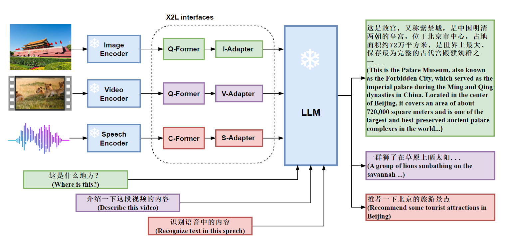
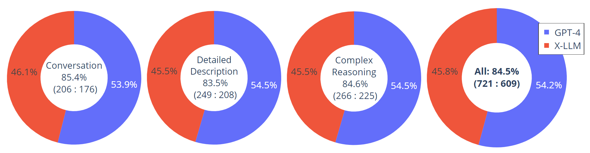
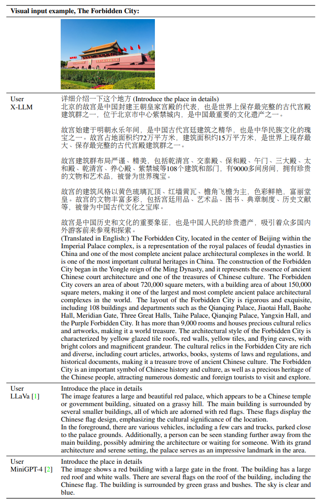
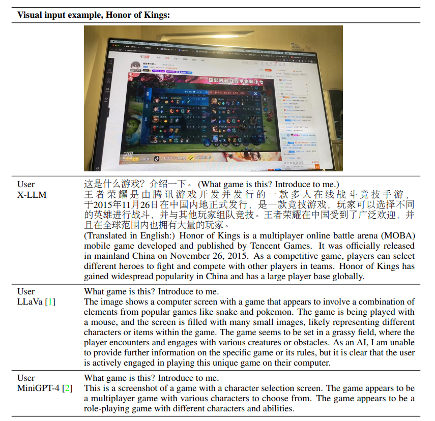

# X-LLM
## X-LLM: Bootstrapping Advanced Large Language Models by Treating Multi-Modalities as Foreign Languages

<!-- [[Project Page](https://x-llm.github.io/)] [[Paper](https://arxiv.org/abs/2305.04160)] -->
<a href='https://x-llm.github.io/'></a>  <a href='https://arxiv.org/abs/2305.04160'></a>

X-LLM converts multi-modalities (images, speech, videos) into foreign languages using X2L interfaces and feed them into a large Language Model (ChatGLM) to accomplish a Multimodal LLM, achieving impressive multimodal chat capabilities.

X-LLM is a general multimodal LLM framework that allows us to incorporate various modalities of information into LLMs, such as (1) non-speech audios, enabling the LLM to have conversations about audios (2) terminal device status information, enabling LLM to control terminal devices, and so on.

<p align="center">
     <br>
    X-LLM framework
</p>

X-LLM connects multiple pre-trained single-modal encoders (such as ViT-g visual encoder) and large language model ChatGLM, using X2L interfaces. We consider a three-stage training procedure:
- Stage 1: Converting Multimodal Information. Convert multimodal information into foreign languages through X2L interfaces, only X2L interfaces are updated
- Stage 2: Aligning X2L Representations with the LLM. Inject foreign languages into LLM, only X2L interfaces are updated.
- Stage 3: Integrating Multiple Modalities. Integrating multi-modalities, only the adapters in X2L interfaces are updated.

## Release
[5/6] We will release the code as soon as poosisble!

## Contents
- [Data Download](#data-download)
- [Install](#install)
- [Training](#training)
- [Evaluation](#evaluation)
- [Performance](#performance)

## Data Download
## Install
## Training
## Evaluation

## Performance
An evaluation dataset with 30 unseen images is constructed: each image is assocaited with three types of instructions: conversation, detailed description and complex reasoning. This leads to 90 new language-image instructions, on which we test X-LLM and GPT-4, and use ChatGPT to rate their responses from score 1 to 10. The summed score and relative score per type is reported. Overall, X-LLM achieves 84.5% relative score compared with GPT-4, indicating the effectinvess of the proposed method in multimodal settings.

<p align="center">
     <br>
</p>

## Examples
Visual input example, The Forbidden City
<p align="center">
     <br>
</p>

Visual input example, Honor of Kings
<p align="center">
     <br>
</p>


## Acknowledgement

- [ChatGLM](https://github.com/THUDM/ChatGLM-6B): The codebase we built upon, and our base model ChatGLM-6B that has the amazing Chinese language capabilities!
- [BLIP2](https://huggingface.co/docs/transformers/main/model_doc/blip-2): The model architecture of X-LLM follows BLIP-2. Don't forget to check this great open-source work if you don't know it before!


If you find X-LLM useful for your your research and applications, please cite using this BibTeX:
```
  @misc{chen2023xllm,
    author      = {Chen, Feilong and Han, Minglun and Zhao, Haozhi and Zhang, Qingyang and Shi, Jing and Xu, Shuang Xu and Xu, Bo},
    title       = {X-LLM: Bootstrapping Advanced Large Language Models by Treating Multi-Modalities as Foreign Languages},
    publisher   = {arXiv:2305.04160},
    year        = {2023}
  }
 ```
