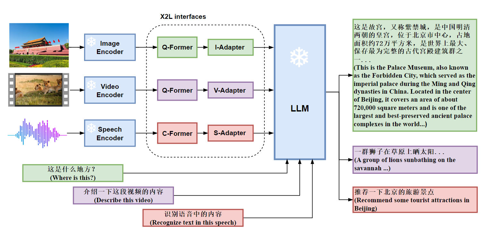
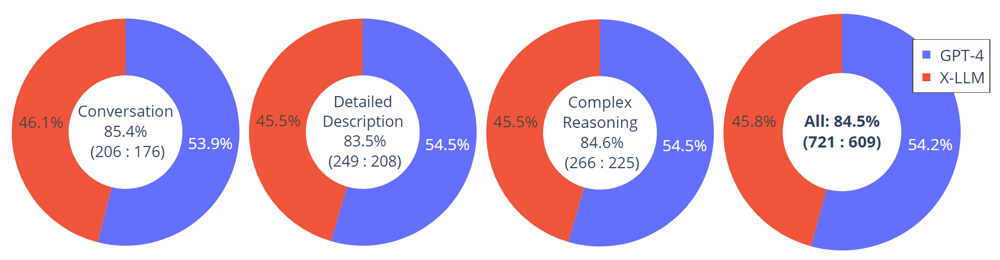
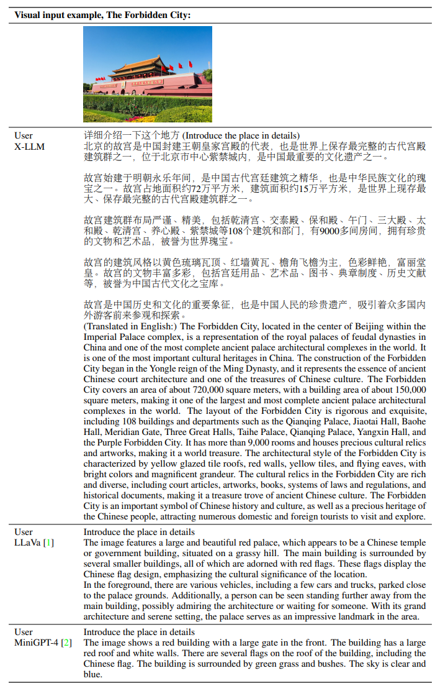
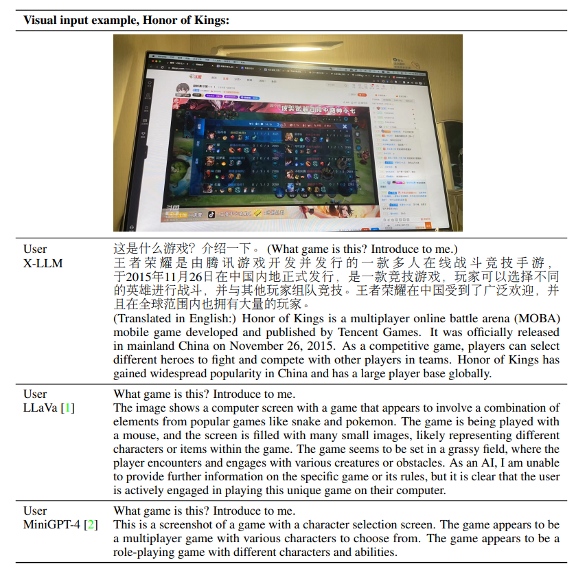

# X-LLM

<div align="center">

## X-LLM: Bootstrapping Advanced Large Language Models by Treating Multi-Modalities as Foreign Languages

[](https://x-llm.github.io/)
[](https://arxiv.org/abs/2305.04160)
[](https://github.com/THUDM/ChatGLM-6B)
[](./LICENSE)

</div>

> 🚀 **X-LLM** aligns multiple **frozen** single-modal encoders and a **frozen** large language model (**ChatGLM**) through **X2L interfaces**, where **"X"** denotes the multi-modalities (image, speech, videos) and **"L"** denotes languages. By treating each modality as a "foreign language", X-LLM builds a Multimodal LLM with impressive multimodal chat abilities — sometimes exhibiting the behaviors of multimodal GPT-4 on unseen images and instructions.

X-LLM is a **general multimodal LLM framework** that lets you incorporate diverse modalities into LLMs, for example:

- **Non-speech audio** — enabling the LLM to converse about audio content.
- **Terminal device status** — enabling the LLM to control terminal devices.
- ...and more.

<p align="center">
   <br>
  <em>The X-LLM framework</em>
</p>

X-LLM connects multiple **pre-trained, frozen** single-modal encoders (e.g., the ViT-g visual encoder, CIF audio encoder) with the **frozen** large language model **ChatGLM** through **X2L interfaces**, following a **three-stage training procedure**:

- **Stage 1 — Converting Multimodal Information.** Each X2L interface is trained **separately** to align its output with the respective single-modal encoder; only the X2L interfaces are updated.
- **Stage 2 — Aligning X2L Representations with the LLM.** Each single-modal encoder is aligned with the LLM **independently** through its X2L interface; only the X2L interfaces are updated.
- **Stage 3 — Integrating Multiple Modalities.** **All** single-modal encoders are jointly aligned with the LLM through the X2L interfaces; only the adapters in the X2L interfaces are updated.

Beyond multimodal chat, X-LLM also conducts **quantitative studies on using the LLM for ASR and multimodal ASR**, aiming to promote the era of LLM-based speech recognition.

---

## Table of Contents

- [Release](#release)
- [Install](#install)
- [Dataset](#dataset)
- [Training](#training)
- [Evaluation](#evaluation)
- [Performance](#performance)
- [Examples](#examples)
- [Acknowledgement](#acknowledgement)
- [Citation](#citation)
- [Star History](#star-history)

---

## Release

- **[5/6]** Code will be released as soon as possible! Stay tuned. ⭐

---

## Install

1. **Create a conda environment**

   ```bash
   conda create -n lavis python=3.8
   conda activate lavis
   ```

2. **Build from source**

   ```bash
   git clone https://github.com/phellonchen/X-LLM.git
   cd X-LLM
   pip install -e .
   ```

---

## Dataset

Please see [**README_DATA.md**](https://github.com/phellonchen/X-LLM/blob/main/README_DATA.md) for details.

---

## Training

Please see [**README_TRAIN_EVAL.md**](https://github.com/phellonchen/X-LLM/blob/main/README_TRAIN_EVAL.md) for details.

---

## Evaluation

Please see [**README_TRAIN_EVAL.md**](https://github.com/phellonchen/X-LLM/blob/main/README_TRAIN_EVAL.md) for details.

---

## Performance

We construct an evaluation set of **30 unseen images**, each paired with three instruction types — **conversation**, **detailed description**, and **complex reasoning** — yielding **90 language-image instructions**. We test X-LLM and GPT-4 on these instructions and use ChatGPT to rate each response from **1 to 10**, reporting the summed score and relative score per type.

Overall, **X-LLM achieves an 84.5% relative score compared with GPT-4**, demonstrating the effectiveness of the proposed method in multimodal settings.

<p align="center">
  
</p>

---

## Examples

**Visual input example — The Forbidden City**

<p align="center">
  
</p>

**Visual input example — Honor of Kings**

<p align="center">
  
</p>

---

## Acknowledgement

- [**ChatGLM**](https://github.com/THUDM/ChatGLM-6B) — The codebase we built upon, and our base model ChatGLM-6B, with its amazing Chinese language capabilities!
- [**BLIP-2**](https://huggingface.co/docs/transformers/main/model_doc/blip-2) — The architecture of X-LLM follows BLIP-2. Be sure to check out this great open-source work if you haven't already!

---

## Citation

If you find X-LLM useful for your research and applications, please cite it using this BibTeX:

```bibtex
@article{chen2023x,
  title   = {X-LLM: Bootstrapping Advanced Large Language Models by Treating Multi-Modalities as Foreign Languages},
  author  = {Chen, Feilong and Han, Minglun and Zhao, Haozhi and Zhang, Qingyang and Shi, Jing and Xu, Shuang and Xu, Bo},
  journal = {arXiv preprint arXiv:2305.04160},
  year    = {2023}
}
```

---

## Star History

<div align="center">

<a href="https://star-history.com/#phellonchen/X-LLM&Date">
  <picture>
    <source media="(prefers-color-scheme: dark)" srcset="https://api.star-history.com/svg?repos=phellonchen/X-LLM&type=Date&theme=dark" />
    <source media="(prefers-color-scheme: light)" srcset="https://api.star-history.com/svg?repos=phellonchen/X-LLM&type=Date" />
    
  </picture>
</a>

</div>

---

⭐ If you find this repository helpful, please consider giving it a star.
